# The Fast Supper

[The Fast Supper](https://github.com/richardreiter/the-fast-supper) is a blog website dedicated to provide more information regarding fasting and its health benefits.

The website is targeted at people who are curious about fasting, so these like-minded people can learn more about it, and engage, commenting on the blog posts.

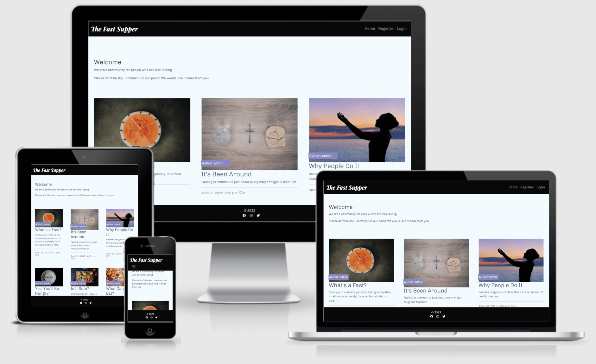

Visit the live site [here.](https://the-fast-supper.herokuapp.com/)

## UX (User Experience)

### Project Goals

- Create a community in which fasting enthusiasts are able to learn more about the subject and exchange ideas through the comment board on the blog posts.
- Provide an educational platform, support and help motivate the users who are currently fasting or thinking about it.

### Target Audience

- Anyone who wants to learn more about fasting.
- People currently on a fast who need a bit of support.
- Fasting practicioners who want to exchange ideas with like-minded people.

### User Stories

Agile methodology tool:

  - GitHub Projects was used to create and [manage a Kanban board](https://github.com/richardreiter/the-fast-supper/projects/1), for planning and implementing this project's functionalities.

- As a Site User I can view a list of posts so that I can easily select one to view.
- As a Site User I can view a list of posts so that I can select one to read.
- As a Site User I can click on a post so that I can read the full content.
- As a Site User / Admin I can view the number of likes on each post so that I can see which is the most popular or viral.
- As a Site User / Admin I can view comments on an individual post so that I can read the conversation.
- As a Site User I can register an account so that I can comment and like.
- As a Site User I can leave comments on a post so that I can be involved in the conversation.
- As a Site User I can like or unlike a post so that I can interact with the content.
- As a Site Admin I can create, read, update and delete posts (CRUD) so that I can manage my blog content both from the front and back-end.
- As a Site Admin I can create draft posts so that I can finish writing the content later.
- As a Site Admin I can approve or disapprove comments so that I can filter out objectionable comments.

### Wireframes

The mockups below were done with the help of Balsamiq (for both desktop and mobile screens), these were useful to help visualise the project.

- Desktop:
  - Home page 
  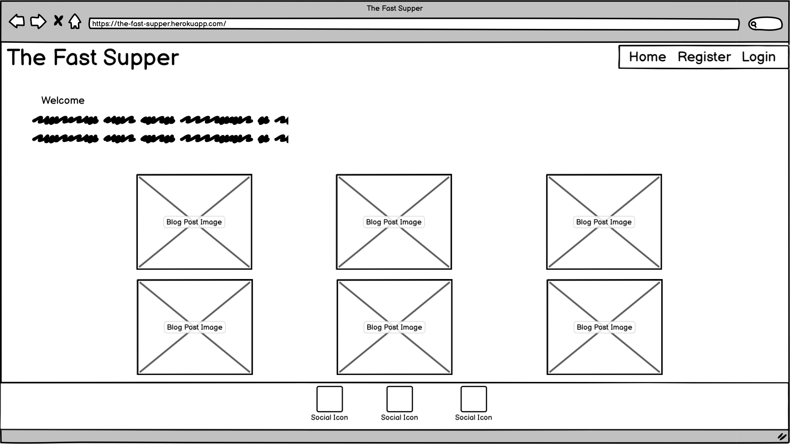
  - Blog post page 
  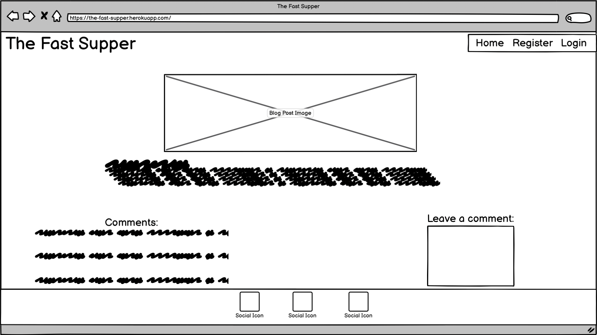
  - Register page
  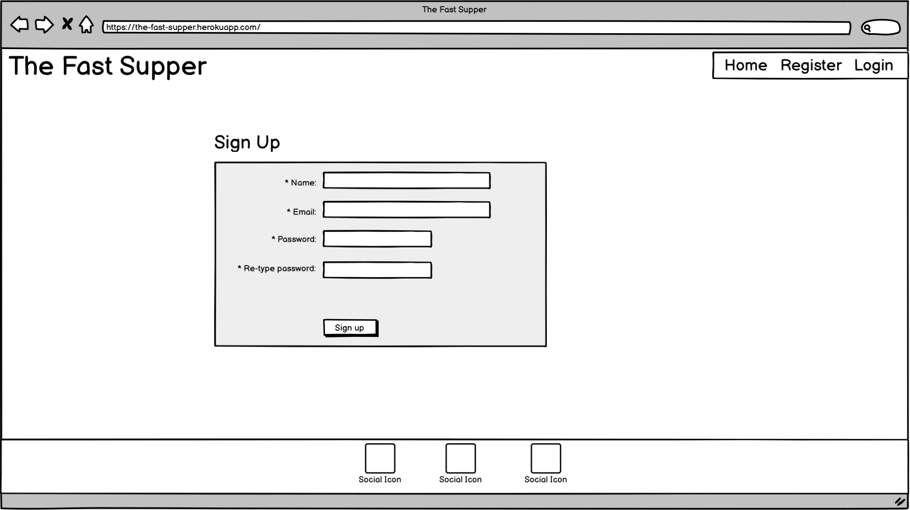
  - Login page
  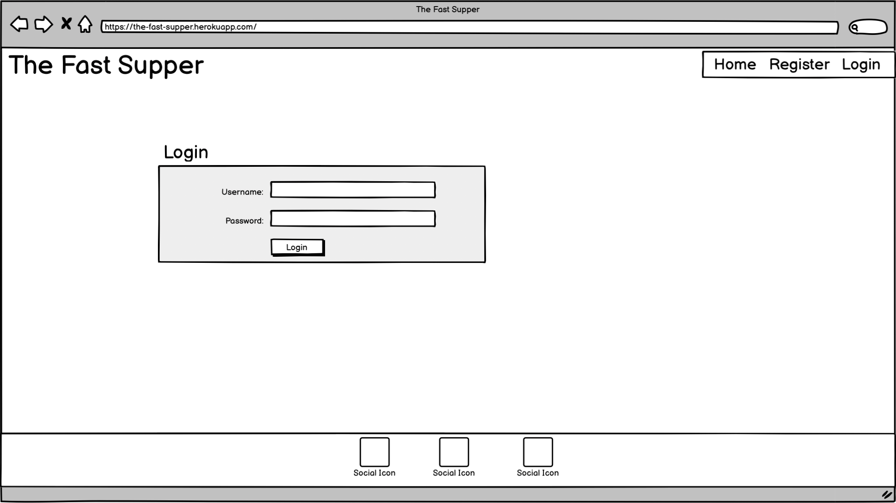

- Mobile:
  - Home page 
  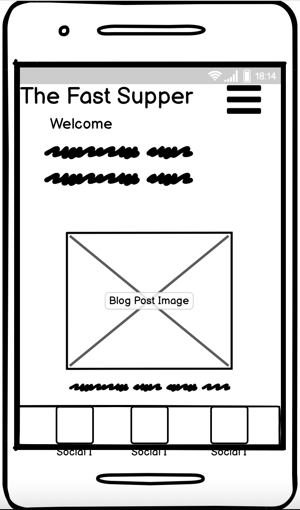
  - Register page
  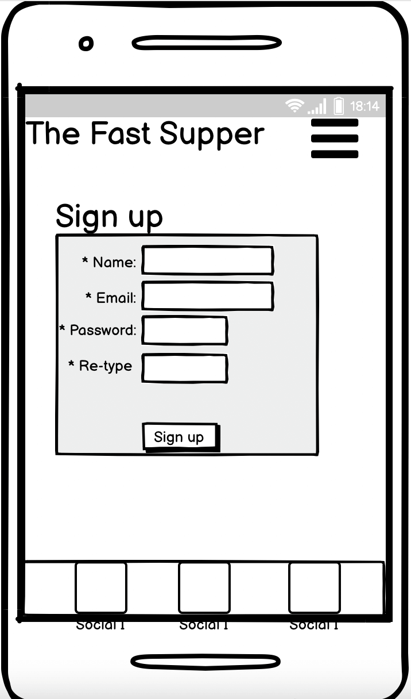
  - Login page
  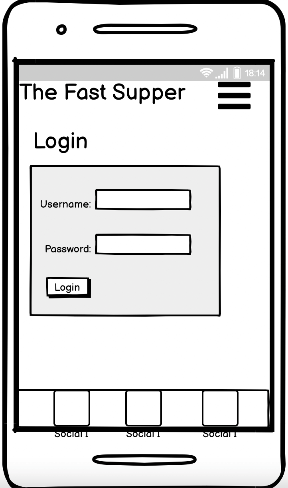

### Design

- The colour scheme was generated with [Coolors.](https://coolors.co/5dfdcb-7cc6fe-f4faff-8789c0-08090a)
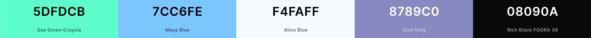

- [Google Fonts](https://fonts.google.com/) was used for the website's fonts. Inspiration on the choice of fonts (Chivo & Playfair Display) came from [this blog post.](https://artisanthemes.io/best-google-fonts-combinations-modern-agency-website/)

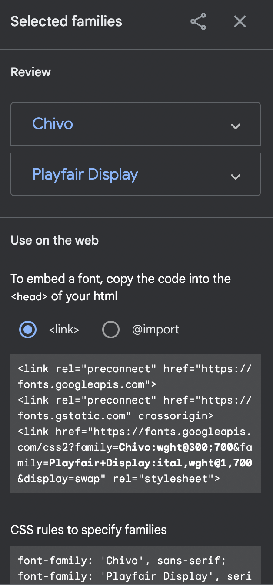

## Features

### Existing Features

- __Navigation Bar__

  - Navigation is a fully responsive feature on all pages, it includes links on the site's Logo (displaying to the left within the bar), Home, Register and Login pages (the 'Add Post' page only shows up for superusers).
   
  - The Logout page shows up (and both Register/Login pages disappear) once the user has successfully registered/logged in.
  
  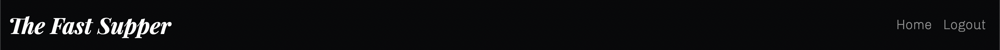
  - The navigation looks the same in each page to allow for easy navigation (without the user having to use the ‘back’ button), taking the user through a logical journey.
  - This section makes it easy for the user to learn more about the site's different sections and contents.

- __About section__

  - About section at home page to welcome and let the users know what the site is about.
   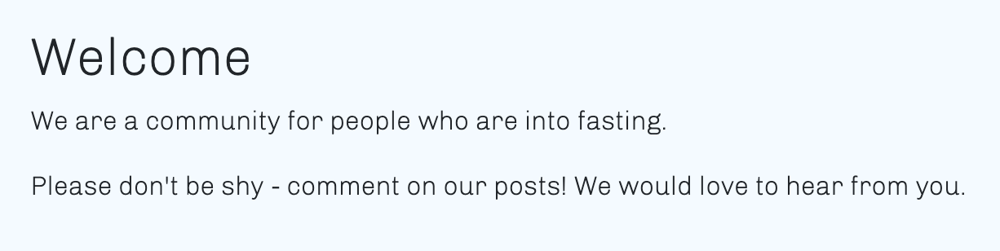

### Features Left to Implement

- 

## Technologies Used

### Languages Used

- 

### Frameworks, Libraries & Programs Used

- 

## Testing

### Testing User Stories from User Experience (UX) Section

- 

### Validator Testing

- 

### Google Lighthouse

- 

### Color Contrast Accessibility Checker

- 

### Responsive Testing

- 

### Device Testing

- 
  - 

### Browser Testing

- 

### Fixed Bugs

- 

## Deployment

- 

## Credits 

### Content

- 

### Media

- 

### Other

- Many thanks to my mentor, Gerry McBride, for his guidance and feedback.