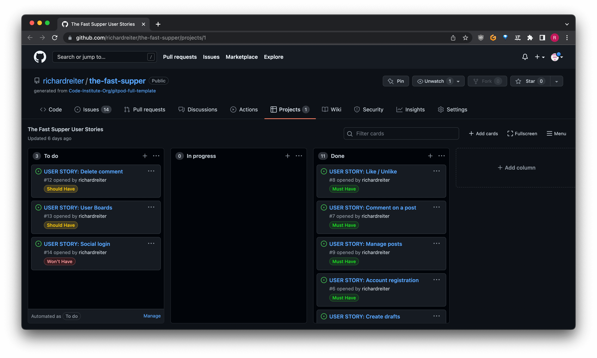
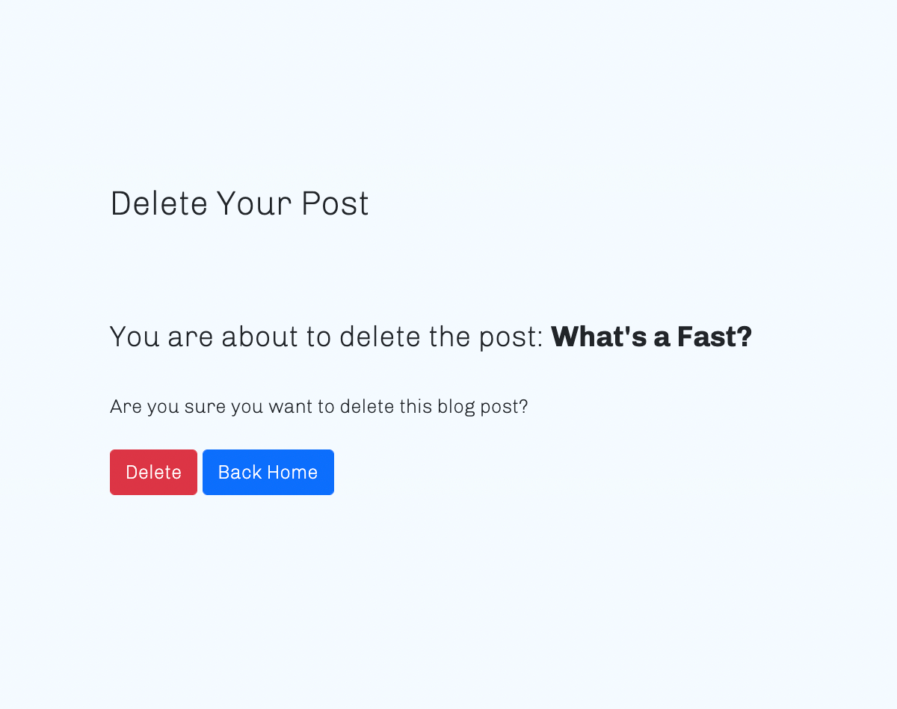

# The Fast Supper

[The Fast Supper](https://github.com/richardreiter/the-fast-supper) is a blog website dedicated to provide more information regarding fasting and its health benefits.

The website is targeted at people who are curious about fasting, so these like-minded people can learn more about it, and engage, commenting on the blog posts.

Visit the live site [here.](https://the-fast-supper.herokuapp.com/)

## UX (User Experience)

### Project Goals

- Create a community in which fasting enthusiasts are able to learn more about the subject and exchange ideas through the comment board on the blog posts.
- Provide an educational platform, support and help motivate the users who are currently fasting or thinking about it.

### Target Audience

- Anyone who wants to learn more about fasting.
- People currently on a fast who need a bit of support.
- Fasting practicioners who want to exchange ideas with like-minded people.

### User Stories

Agile methodology tool:

  - GitHub Projects was used to create and [manage a Kanban board](https://github.com/richardreiter/the-fast-supper/projects/1), for planning and implementing this project's functionalities.

- As a Site User I can view a list of posts so that I can easily select one to view.
- As a Site User I can view a list of posts so that I can select one to read.
- As a Site User I can click on a post so that I can read the full content.
- As a Site User / Admin I can view the number of likes on each post so that I can see which is the most popular or viral.
- As a Site User / Admin I can view comments on an individual post so that I can read the conversation.
- As a Site User I can register an account so that I can comment and like.
- As a Site User I can leave comments on a post so that I can be involved in the conversation.
- As a Site User I can like or unlike a post so that I can interact with the content.
- As a Site Admin I can create, read, update and delete posts (CRUD) so that I can manage my blog content both from the front and back-end.
- As a Site Admin I can create draft posts so that I can finish writing the content later.
- As a Site Admin I can approve or disapprove comments so that I can filter out objectionable comments.

### Wireframes

The mockups below were done with the help of Balsamiq (for both desktop and mobile screens), these were useful to help visualise the project.

- Desktop:
  - Home page 
  
  - Blog post page 
  
  - Register page
  
  - Login page
  

- Mobile:
  - Home page 
  
  - Register page
  
  - Login page
  

- Models Diagrams:
  

### Design

- The colour scheme was generated with [Coolors.](https://coolors.co/5dfdcb-7cc6fe-f4faff-8789c0-08090a)

- [Google Fonts](https://fonts.google.com/) was used for the website's fonts. Inspiration on the choice of fonts (Chivo & Playfair Display) came from [this blog post.](https://artisanthemes.io/best-google-fonts-combinations-modern-agency-website/)

## Features

### Existing Features

- __Navigation Bar__

  - Navigation is a fully responsive feature on all pages, it includes links on the site's Logo (displaying to the left within the bar), Home, Register and Login pages (the 'Add Post' page only shows up for superusers).
    
  - The Logout page shows up (and both Register/Login pages disappear) once the user has successfully registered/logged in.
    
    
  - The navigation looks the same in each page to allow for easy navigation (without the user having to use the ‘back’ button), taking the user through a logical journey.
  - This section makes it easy for the user to learn more about the site's different sections and contents.

- __About section__

  - About section at home page to welcome and let the users know what the site is about.
   

- __Blog Posts section__

  - The Blog posts section displays six posts at a time (with featured images, author, titles, post date, excerpt), feturing pagination ("NEXT", "PREV" buttons show up), in case there are seven or more posts.
   

- __Footer__

  - The footer area consists of three social links of the blog (Facebook, Instagram and Twitter - all of them, if clicked, open on a separate tab) and a "Copyright 2022" writing.
  - Like the navigation section, the footer looks the same on each page (and features on all of the pages) to allow for easy navigation, taking the user through a logical journey.

- __Blog Post page__

  - Featuring the post image, post title, post author and post date (two links "Edit" & "Delete" which only show up in case the logged in user is an admin).
    
  - Post body content, like and comment count.
    
  - Comment and likes counter which displays how many users liked that particular post, if the user clicks on the heart icon they like or unlike the post.
    
  - The comments section, features information displayed from all users who have posted comments, such as their username, date of the comment and comment's content. It also features a text field to the right, so users who are logged in are able to engage with each other/the post and submit a comment.
    
  - Comments moderation for the admins so they can approve or disapprove users' comments (once an user submits a comment, the message below appears to them).
    

- __Add Post page__

  - If the user is logged in as an admin, they are able to add a blog post (both from the front and backend), simply by clicking on the "Add Post" navigation link.
  - The page features a form where the user can fill out all the details for the new post, such as title, slug, author, image (upload a featured image), content, status (draft or published).
    

- __Edit Blog Post page__

  - If the user is logged in as an admin, they are able to Edit any of the Blog posts (both from the front and backend), simply by clicking on the "Edit" link at the blog post's header.
  - The page features a form where the user can edit the current post's details such as title, content and excerpt.
    

- __Delete Blog Post page__

  - If the user is logged in as an admin, they are able to delete any of the Blog posts (both from the front and backend), simply by clicking on the "Delete" link at the blog post's header.
  - The page displays the selected post for deletion's title, a warning message and two buttons (delete, back home).
    

### Features Left to Implement

- __Forum/Members Area__

  - Implementing a forum/members area in the future could be really beneficial for The Fast Supper community, so the users would be able to have accountability partners as opposed to just exchanging ideas via the blog posts.

## Technologies Used

### Languages Used

- [HTML5](https://developer.mozilla.org/en-US/docs/Glossary/HTML5)
- [CSS3](https://developer.mozilla.org/en-US/docs/Web/CSS)
- [JavaScript](https://developer.mozilla.org/en-US/docs/Web/JavaScript)
- [Python3](https://developer.mozilla.org/en-US/docs/Glossary/Python)

### Frameworks, Libraries & Programs Used

- [Balsamiq](https://balsamiq.com/)
  - Balsamiq was used to make desktop/mobile mockups in order to visualise the project.
- [Bootstrap](https://getbootstrap.com/)
  - Bootstrap template.
- [Cloudinary](https://cloudinary.com/)
  - Cloudinary was used to store the project's images.
- [Django](https://www.djangoproject.com/)
  - Django was used to build the app.
- [Django Allauth](https://django-allauth.readthedocs.io/en/latest/overview.html/)
  - Django allauth for account management.
- [Django Crispy Forms](https://django-crispy-forms.readthedocs.io/en/latest/)
  - Django Crispy Forms for rendering elegant DRY forms.
- [Font Awesome](https://fontawesome.com/)
  - Font Awesome was used to add icons to improve the design of the website.
- [Git](https://git-scm.com/) & [Gitpod](https://gitpod.io/)
  - Git was used for version control via the Gitpod terminal in order to commit to Git and push to GitHub.
- [GitHub](https://github.com/)
  - GitHub was used for version control.
- [Google Fonts](https://fonts.google.com/)
  - Google Fonts was used to import the fonts which are used on the website.
- [Heroku](https://heroku.com/)
  - Heroku was used for hosting and deploying the game.
- [Lucidchart](https://www.lucidchart.com/)
  - Lucidchart was used for drawing the database models.
- [PostgreSQL](https://www.postgresql.org/)
  - PostgreSQL for database management.
- [Summernote](https://summernote.org/)
  - Summernote WYSIWYG for Bootstrap.

## Testing

### Validator Testing

- HTML
  - No errors/warnings were returned when passing through the official [W3C validator](https://validator.w3.org/nu/?doc=https%3A%2F%2Fthe-fast-supper.herokuapp.com%2F)
  

- CSS
  - No errors were found when passing through the official [(Jigsaw) validator](https://jigsaw.w3.org/css-validator/validator?uri=https%3A%2F%2Fthe-fast-supper.herokuapp.com%2F&profile=css3svg&usermedium=all&warning=1&vextwarning=&lang=en)
  

- Python
    - No errors were returned when passing through the [PEP8online check.](http://pep8online.com/)
  

### Google Lighthouse

- Google's Lighthouse was used for measuring the quality of the pages.
  - Home Page (desktop) result:
  

  - Home Page (mobile) result:
  

### Color Contrast Accessibility Checker

- [a11y Color Contrast Accessibility Validator](https://color.a11y.com/) was used to analyse the contrast of the site and make sure it complies with website accessibilities regulations.
  - Home Page result:
  

### Responsive Testing

- __[Am I Responsive?](http://ami.responsivedesign.is/)__
  - This design tool was used to show how responsive the website is and looks across 4 different viewports (Desktop, Laptop, Tablet and Mobile):

### Device Testing

- The Fast Supper website was tested on several devices/environments (without any issues), including:
  - MacBook Air 13.3" M1 2020 (macOS Monterey 12.3.1)
  - Lenovo 5i i5 15" (Windows 10 64x)
  - iPhone 6
  - iPhone 7
  - Google Pixel 4a (Android 12)
  - Google Pixel 6 (Android 12)

### Browser Testing

- The Fast Supper website was tested on several browsers (without any issues - across different devices), including:
  - Google Chrome (100.0.4896.127) (arm64)
  - Mozilla Firefox (99.0.1 (64-bit))
  - Safari (Version 15.4 (17613.1.17.1.13))
  - Microsoft Edge
  - Brave (Version 1.37.116 Chromium: 100.0.4896.127 (Official Build) (arm64))
  - Vivaldi (4.3.2439.65 (Stable channel) (arm64))

### Known Bugs

- When adding a new post via the front end page "Add Post", the placeholder image is always the one to show up, regardless of any other images being selected/uploaded. As a workaround the blog post's placeholder image can later be replaced via the Django Admin Panel.

## Deployment

### Deploying on Heroku

To deploy this application to [Heroku](https://dashboard.heroku.com/) from its GitHub repository, the following steps were taken:
- Log into Heroku
- Select "New" and "Create new app".
- Name the new app, choose the region and click "Create app".
- In the "Resources" tab, search for "postgres" at the add-ons text field, select the "Heroku Postgres", then "Hobby Dev", submit.
- In the "Settings" tab, click on "Reveal Config Vars" and input the following key/values:
  - CLOUDINARY_URL
  - DATABASE_URL
  - SECRET_KEY

- Click on "Deploy" and select your deploy method and repository.
- Click "Connect" on selected repository
- Click "Deploy Branch" in the manual deploy section. -Heroku will now deploy the App.

Development Environment
- Create env.py, import os and input the following variables:
    - os.environ["DATABASE_URL"] = "postgres://....."
    - os.environ["SECRET_KEY"] = "....."
    - os.environ["CLOUDINARY_URL"] = "....."
    - os.environ["DEVELOPMENT"] = "True"
    - os.environ["CLOUDINARY_CLOUD_NAME"] = '.....'
    - os.environ["CLOUDINARY_API_KEY"] = '.....'
    - os.environ["CLOUDINARY_API_SECRET"] = '.....'

- Create the requirements.txt file.
`pip3 freeze --local > requirements.txt`
- Create Procfile.
- Click "Deploy" at the top to go to the Deployment settings tab.
- Choose "GitHub" as the deployment method.
- Choose "Automatic deploys" if you would like to enable a chosen branch to be automatically deployed with every GitHub push to the branch.
- Use "Manual deploy" to deploy the current state of a branch to this app (simply enter the name of the branch and "Deploy Branch").
- Once the deployment has completed click on "View app".

### Final Deployment on Heroku
GitHub had a security breach and manual deployment via CLI was necessary.

- Set debug flag to false in settings.py `DEBUG = FALSE`.
- In settings.py add `X_FRAMES_OPTIONS = SAMEORIGIN`.
- Login to heroku, enter credentials.
`heroku login -i`
- Get your app name from heroku.
`heroku apps`
- Set the heroku remote. (Replace <app_name> with the actual app name).
`heroku git:remote -a <app_name>`
- Add, commit and push to github
`git add . && git commit -m "Deploy to Heroku via CLI"`
- Push to both github and heroku:
`git push origin main`
`command: git push heroku main`

### Forking the Repository

By forking the GitHub Repository you make a copy of the original repository on you GitHub account to view and/or make changes without affecting the original repository.

To achieve that simply:

- Log into GitHub.
- Locate the GitHub Repository in question.
- At the top of the repository, on the right side of the page, select "Fork"
- You should now have a copy of the original repository in your GitHub account.

### Creating a Clone

How to run this project locally:

- Install the GitPod Browser Extension for Google Chrome.
- Log into GitHub.
- Locate the GitHub Repository you'd like to clone in question.
- Click the green "GitPod" button in the top right corner of the repository. This will create a new GitPod.

## Credits 

### Content

- The instructions on [how to reset/remove the latest Git commit from a repo](https://gist.github.com/CrookedNumber/8964442) were taken from [this GitHub Gist.](https://gist.github.com/CrookedNumber/8964442)
- Many thanks to John Elder's Codemy for the ["Create A Simple Blog With Python
and Django"](https://www.youtube.com/watch?v=tKSUokG3Y0w) which was a good reference and example. 
- A huge thank you to Matt Rudge and Code Institute for the ["I Think Therefore I Blog" Walkthrough project](https://github.com/Code-Institute-Solutions/Django3blog) which was a great reference, inspiration and example.

### Media

- All the website's images were taken from [Unsplash.](https://unsplash.com/)
- All the blog posts' content was taken from this [WebMD link.](https://www.webmd.com/diet/obesity/ss/slideshow-fasting-overview)

### Other

- Many thanks to my mentor, Gerry McBride, for his guidance and feedback.